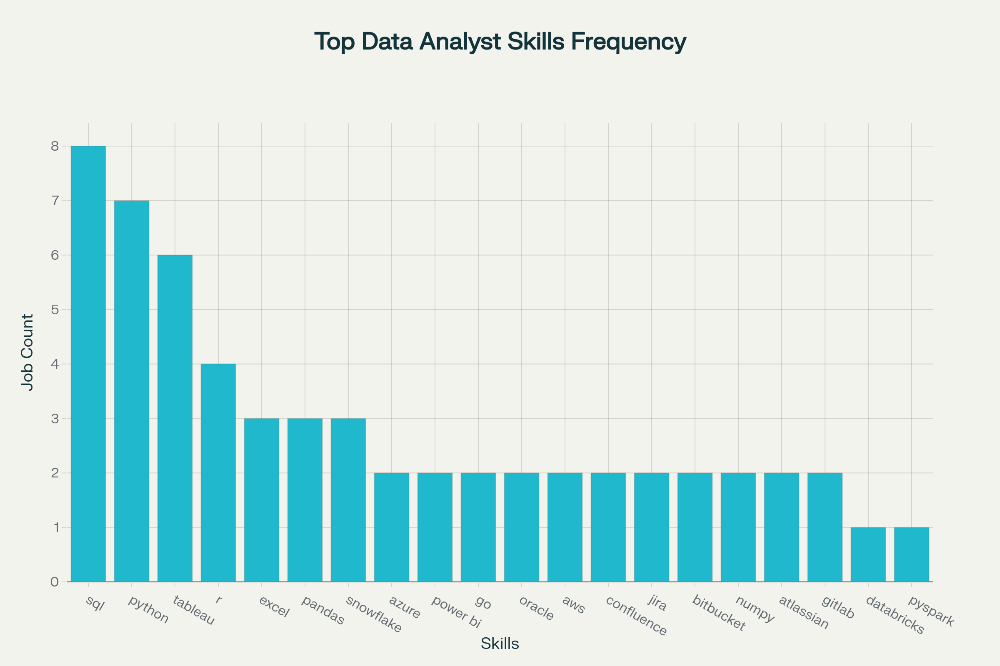
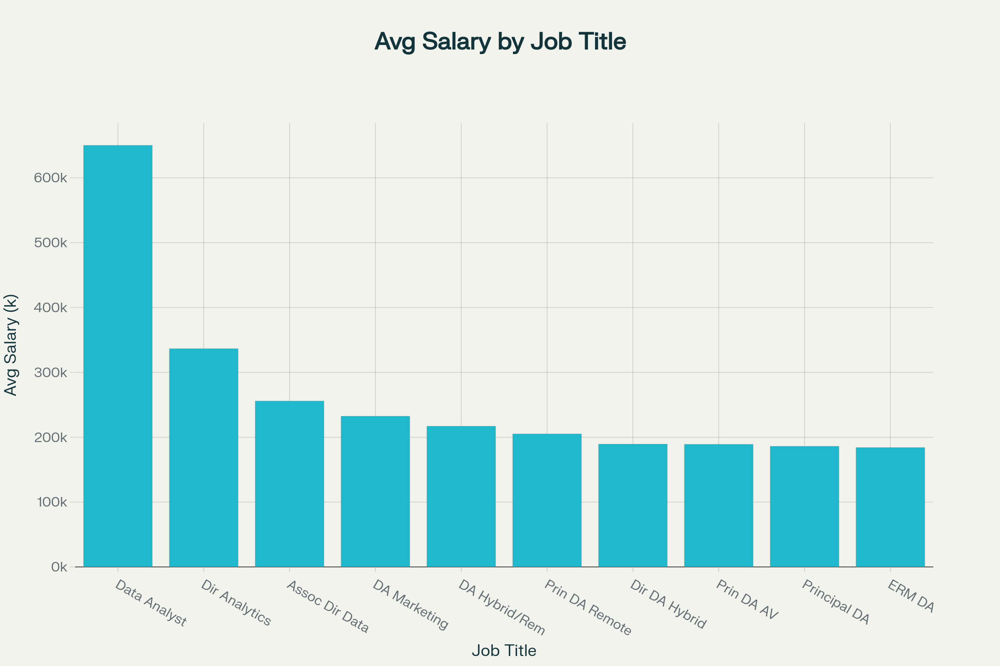

# Introduction
This project analyzes job posting data specifically for Data Analyst roles, aiming to provide actionable insights into the current job market landscape for data analysis professionals. Using SQL queries, the focus is on identifying the top-paying Data Analyst jobs, uncovering the most in-demand skills, and determining the optimal skill set that aligns both high demand and high salary.

By examining real-world job postings with detailed salary and skill information, this project offers valuable guidance for job seekers and professionals looking to strategically develop their skill set. The insights highlight which technical skills are crucial for securing premium Data Analyst roles and help prioritize learning paths that boost career growth and job security in this evolving field.

SQL Queries? Check them out here : [project_SQL folder](/project_sql/)

# Background
Driven by a quest to navigate the data analyst job market more effectively, this project was born from a desire to pinpoint top-paid and in-demand skills, streamlining others work to find optimal jobs.

Data hails from my [SQL Course](https://lukebarousse.com/sql). It's packed with insights on job titles, salaries, locations, and essential skills.

### The questions I wanted to answer through my SQL queries were:

1. What are the top-paying data analyst jobs?
2. What skills are required for these top-paying jobs?
3. What skills are most in demand for data analysts?
4. Which skills are associated with higher salaries?
5. What are the most optimal skills to learn?


# Tools I used

For my deep dive into the data analyst job market, I harnessed the power of several key tools:

- **SQL**: The backbone of my analysis, allowing me to query the database and unearth critical insights.
- **PostgreSQL**: The chosen database management system, ideal for handling the job posting data.
- **Visual Studio Code**: My go-to for database management and executing SQL queries.
- **Git & GitHub**: Essential for version control and sharing my SQL scripts and analysis, 

# The Analysis
Each query for this project aimed at investigating specific aspects of the data analyst job market. Here’s how I approached each question:

### 1. Top Paying Data Analyst Jobs

To identify the highest-paying roles, I filtered data analyst positions by average yearly salary and location, focusing on remote jobs. This query highlights the high paying opportunities in the field.

    ```sql
    SELECT
        jpf.job_id,
        jpf.job_title,
        jpf.job_location,
        jpf.job_schedule_type,
        jpf. salary_year_avg,
        jpf. job_posted_date,
        cd.name AS company_name

        FROM
        job_postings_fact AS jpf

        LEFT JOIN company_dim AS cd ON
        cd.company_id = jpf.company_id

        WHERE job_title_short = 'Data Analyst' AND 
        job_location = 'Anywhere' AND
        salary_year_avg IS NOT NULL

        ORDER BY salary_year_avg DESC
        LIMIT 10
         ``` 
Here's the breakdown of the top data analyst jobs in 2023:

- **Wide Salary Range:** Top 10 paying data analyst roles span from $184,000 to $650,000, indicating significant salary potential in the field.

- **Diverse Employers:** Companies like SmartAsset, Meta, and AT&T are among those offering high salaries, showing a broad interest across different industries.

- **Job Title Variety:** There's a high diversity in job titles, from Data Analyst to Director of Analytics, reflecting varied roles and specializations within data analytics.


*Bar graph visualizing the salary for the top 10 salaries for data analysts; ChatGPT generated this graph from my SQL query results*

### 2. Top Paying jobs skills

Identified the specific skills required for the top 10 highest-paying Data Analyst jobs by extracting and analyzing skill requirements from job postings with the highest average salaries. This helped reveal which technical skills are most valued in premium roles, providing focused career insights for data analysts seeking top compensation.

*Top skills to master that are high paying*

### 3. In-Demand skills for Data Analysis
This query helped identify the skills most frequently requested in job postings, directing focus to areas with high demand.

| Skills     | Demand Count |
|------------|-------------|
| sql        | 92,628      |
| excel      | 67,031      |
| python     | 57,326      |
| tableau    | 46,554      |
| power bi   | 39,468      |
*Table for demand of top 5 skills required for Data analysis*

### 4. Skills based on Salary
Exploring the average Salaries associated with different skills revealead which skills are highest paying

``` sql
SELECT
skills,
ROUND (AVG(salary_year_avg), 0) AS avg_salary


FROM job_postings_fact

INNER JOIN skills_job_dim ON  
job_postings_fact.job_id = skills_job_dim.job_id

INNER JOIN skills_dim ON
skills_job_dim.skill_id = skills_dim.skill_id

WHERE job_title_short = 'Data Analyst' AND 
salary_year_avg IS NOT NULL AND
job_work_from_home = 'TRUE'

GROUP BY skills

ORDER BY avg_salary DESC

LIMIT 25
```

| Skill          | Average Salary |
|----------------|----------------|
| pyspark        | 208172         |
| bitbucket      | 189155         |
| couchbase      | 160515         |
| watson         | 160515         |
| datarobot      | 155486         |
| gitlab         | 154500         |
| swift          | 153750         |
| jupyter        | 152777         |
| pandas         | 151821         |
| elasticsearch  | 145000         |
| golang         | 145000         |
| numpy          | 143513         |
| databricks     | 141907         |
| linux          | 136508         |
| kubernetes     | 132500         |
| atlassian      | 131162         |
| twilio         | 127000         |
| airflow        | 126103         |
| scikit-learn   | 125781         |
| jenkins        | 125436         |
| notion         | 125000         |
| scala          | 124903         |
| postgresql     | 123879         |
| gcp            | 122500         |
| microstrategy  | 121619         |
*Table for average salary for top paying skills*

### 5. Most Optimal skills to learn

Combining insights from demand and salary data, this query aimed to pinpoints skills that are both in high demand and have high salaries, offering strategic focus for skill development.

``` sql
    SELECT
    skills_dim.skills,
    skills_dim.skill_id,
    COUNT(skills_job_dim.job_id) AS demand_skills,
    ROUND (AVG(job_postings_fact.salary_year_avg),0) AS avg_salary


    FROM 
    job_postings_fact

    INNER JOIN skills_job_dim ON 
    job_postings_fact.job_id = skills_job_dim.job_id

    INNER JOIN skills_dim ON 
    skills_job_dim.skill_id = skills_dim.skill_id

    WHERE job_title_short = 'Data Analyst' AND
    salary_year_avg IS NOT NULL AND
    job_work_from_home = 'TRUE'

    GROUP BY skills_dim.skill_id

    HAVING COUNT(skills_job_dim.job_id)> 10

    ORDER BY avg_salary DESC,
             demand_skills DESC

            LIMIT 25
```

| Skill      | Skill ID | Demand Skills | Average Salary |
|------------|----------|--------------|---------------|
| go         | 8        | 27           | 115320        |
| confluence | 234      | 11           | 114210        |
| hadoop     | 97       | 22           | 113193        |
| snowflake  | 80       | 37           | 112948        |
*Table for most optimal skills for Data Analysis for 2023*

# What I learned

Throughout this adventure, I've turbocharged my SQL toolkit with some serious firepower:

-**Complex Query Crafting**: Mastered the art of advanced SQL, merging tables like a pro and wielding WITH clauses for ninja-level temp table maneuvers.

-**Data Aggregation**: Got cozy with GROUP BY and turned aggregate functions like COUNT() and AVG() into my data-summarizing sidekicks.

-**Analytical Wizardry**: Leveled up my real-world puzzle-solving skills, turning questions into actionable, insightful SQL queries.

# Conclusions

### insights 

From the Analysis several different insights emerged:

1.Top-Paying Data Analyst Jobs: The highest-paying jobs for data analysts that allow remote work offer a wide range of salaries, the highest at $650,000.

2.Skills for Top-Paying Jobs: High-paying data analyst jobs require advanced proficiency in SQL, suggesting it’s a critical skill for earning a top salary.

3.Most In-Demand Skills: SQL is also the most demanded skill in the data analyst job market, thus making it essential for job seekers.

4.Skills with Higher Salaries: Specialized skills, such as SVN and Solidity, are associated with the highest average salaries, indicating a premium on niche expertise.

5.Optimal Skills for Job Market Value: SQL leads in demand and offers for a high average salary, positioning it as one of the most optimal skills for data analysts to learn to maximize their market value.

### Closing Thoughts
This project enhanced my SQL skills and provided valuable insights into the data analyst job market. The findings from the analysis serve as a guide to prioritizing skill development and job search efforts. Aspiring data analysts can better position themselves in a competitive job market by focusing on high-demand, high-salary skills. This exploration highlights the importance of continuous learning and adaptation to emerging trends in the field of data analytics.

